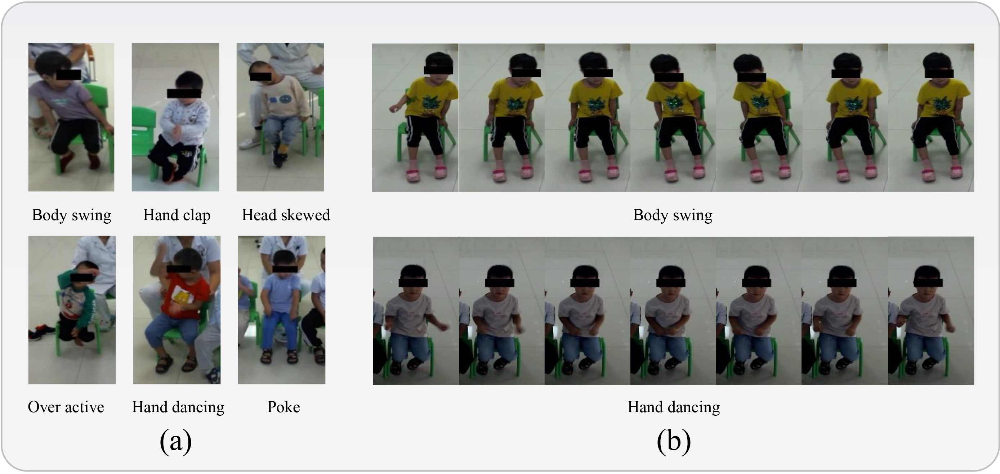
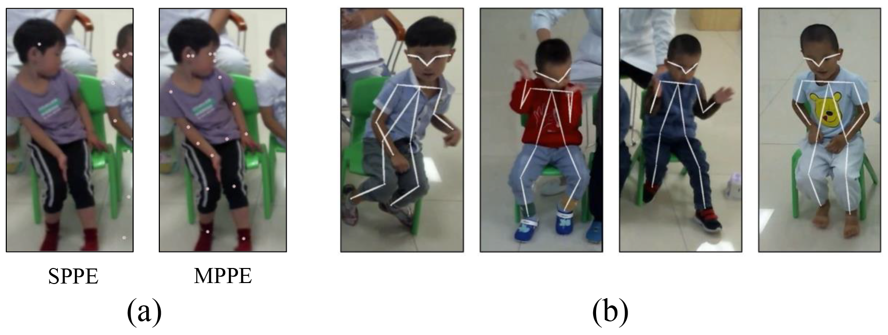

# ACSA653 Dataset Overview

- **Dataset Name**: ACSA653
- **Scale**: Comprises 653 video clips
- **Number of Classes**: 6 types of stereotyped movements
  - Categories include: body swing, hand clap, head skewed, overactive, hand dancing, and poke
- **Data Collection Environment**: 
  - Collected in a Mixed Reality (MR) Aquarium Training System to ensure natural behavior.
  - During training, children interacted with virtual creatures, with a camera positioned above the aquarium to record their actions.
- **Video Quality**: Manually cropped and edited to ensure uniform specifications and high quality.
- **Participants**: 6 children with Autism Spectrum Disorder (ASD)
- **Data Annotation**: 
  - Annotated manually by five doctors, recording the start and end times of the stereotyped movements and their categories.
  - Videos were segmented and categorized based on the annotated movement types.
- **Comparison Advantages**:
  - Compared to existing public datasets, ACSA653 offers significant advantages in terms of sample size, action categories, and modalities (RGB+Skeleton).

This dataset provides a valuable resource for studying the recognition of stereotyped movements in children with ASD, facilitating deeper analysis of behavioral patterns.

 Fig.1 Data Overview

 Fig.2 Dataset Modality

## Citation
Please cite these papers in your publications if it helps your research:

    @article{apmfnet,
      author={Zhang, Baiqiao and Yuan, Yanran and Qin, Wei and Li, Xiangxian and Liu, Weiying and Yao, Wenxin and Bian, Yulong and Liu, Juan},
      journal={IEEE Journal of Biomedical and Health Informatics}, 
      title={Enhancing Recognition of Stereotyped Movements in ASD Children Through Action Pattern Mining and Multi-Channel Fusion}, 
      year={2024},
      volume={},
      number={},
      pages={1-15},
    }
    
## License
Because of the data sharing policy of our group, data of the paper cannot be released here directly. If you are interested in using the data, please contact the authors (baiqiao@mail.sdu.edu.cn), to get them for non-commercial use only. Please provide your name, institution, and purpose of using the data, and please cite the paper if you use the data.